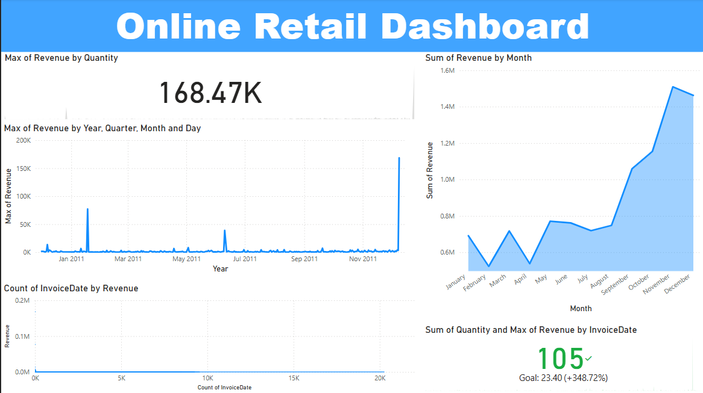
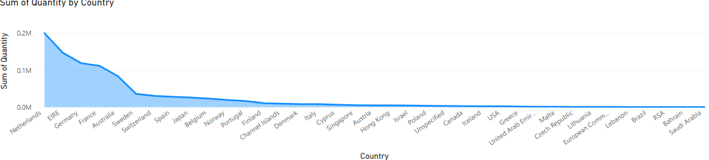
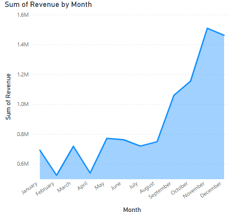

# 🛍️ Online Retail Analytics Dashboard | Power BI Project

A clean and insightful Power BI dashboard built to analyze the performance of an online retail store. The dashboard includes interactive visualizations on product sales, customer behavior, regional performance, and overall sales trends — empowering data-driven decision-making.

---

## 📊 Dashboard Highlights

- 📦 **Top-Selling Products** by revenue and quantity
- 🌍 **Sales by Country**: Visual map and regional trends
- 📈 **Monthly & Yearly Revenue Trends**
- 👥 **Customer Purchase Behavior**
- 📉 **Returns & Cancellations (if any)**
- 📌 Slicers to dynamically filter by country, product category, and year

---

## 🛠️ Tools Used

- Power BI Desktop (.pbix)
- DAX for measures like:
  - Total Revenue
  - Avg. Order Value
  - Monthly Sales Growth
- Power Query for data shaping
- CSV or Excel (source dataset)

---

## 📁 Repository Structure

| Folder/File         | Description                                      |
|---------------------|--------------------------------------------------|
| `pbix/`             | Main Power BI file (`Data_visualization_for_online_retail.pbix`) |
| `assets/`           | Screenshots of key dashboard visuals             |
| `README.md`         | Project overview and documentation               |

---

## 🖼️ Dashboard Previews

### 🔹 Overview

### 🔹 Sales by Country

### 🔹 Top Monthly Revenue

---

## 📥 How to View Locally

1. Download the `.pbix` file from the `pbix/` folder.
2. Open with [Power BI Desktop](https://powerbi.microsoft.com/en-us/desktop/).
3. Replace or relink the dataset if required.

---

## 💼 Details of the project

- Designed a data-rich retail analytics dashboard in Power BI for sales and operations tracking across multiple countries and product categories.
- Developed interactive visualizations and KPIs using DAX and Power Query.
- Delivered insights on top-selling products, underperforming regions, and customer trends.

## 📬 Contact

Created by **[Bhanu Pranav]**  
📧 [panchadarlabhanupranav@gmail.com] 
🔗 [LinkedIn](www.linkedin.com/in/bhanu-pranav-panchadarla-7b83872a6)
